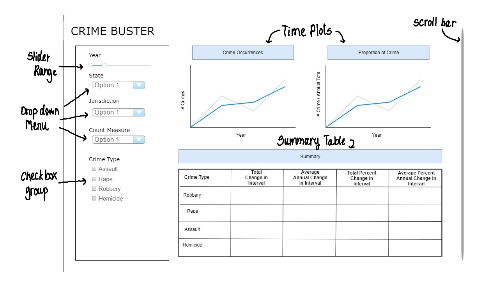

# Milestone 1 - Proposal

## Overview

The government is working on policy implementation in the United States to keep a control over the violent crimes mainly rape, homicides, assault and robbery. The officials are interested in looking at how the crime situation has changed over last couple of years at ground root level so they can allocate their resources accordingly and make changes in the policies. Our Crime_buster_App aims to provide the visualization of the trend of the number of crimes committed in major jurisdictions of the United States and over the time period selected by the user. This can help analyze the situation specific to each jurisdiction and investigate and address the problems accordingly.

## Crime Data in hand

The crime data over the period of 40 years (1975 and 2015) has been complied under the Marshall project from the FBI's Uniform Crime Reporting (UCR) Program. The most serious crime incidents namely robbery, rape, assault and homicides from 68
police jurisdictions have been used for creating the Crime_buster_App. The source of the data is [Uniform Crime Reporting program's](https://www.icpsr.umich.edu/icpsrweb/NACJD/series/57) 'Offenses Known and Clearances by Arrest' database held at the National Archives of Criminal Justice Data. The total number of incidents and incidents per 100,000 residents per jurisdictions have been collected where the population data comes from FBI's estimated population for that year.

The data under consideration has the following features :

| Features   | Description   |
|---|---|
|`State`   | State within Unites States  |
|`Department`   |  Jurisdiction  |
| `year`  |  Year of consideration |
| `violent_crime` , `violent_per_100k`  | Total Violent crimes and crimes per 100k residents  |
| `homs`,`homs_per_100k`  | Total Homicides and homicides per 100k residents |
| `rape`, `rape_per_100k`  | Total Rapes and rapes per 100k residents   |
|  `rob`,`rob_per_100k` |  Total robberies and robberies per 100k residents  |
|`assault`,`agg_ass_per_100k`| Total assaults and assaults per 100k residents  |

## Usage scenario & tasks

Bob is a sheriff in the Chicago Police Department and He is tasked to create a new annual plan for the new year. One for the aim of the new plan is to reduce crime rate in his jurisdiction, so Bob wants to explore the trend and pattern of crime occurrences in the past 10 years. When Bob opens the "Crime_buster_App", he will see different time plots of crime data (in counts and in percentage), and a summary of changes are shown. He can select for specific year interval, police department, measurement metric (total count or count per 100k population). Additionally, Bob can choose to see data for all types of crime or a subset of crimes. Using the app, Bob finds that in the interval of 2010 - 2015, rape crimes increased while homicides decreased in the city of Chicago. He hypothesized that the past crime prevention strategies were efficient towards homicides, but was insufficient in rape crime preventions. Hence, Bob decided to form an investigation group to investigate on the cause of rape crime increase in the past years and to strategize targeted prevention.

## Description and sketch of Crime-Crime_buster_App

The landing page of the app will show two time plots. The first time plot will depict the change of total number of crimes over years. The second time plot depicts how the proportion of different crimes changed throughout the years. There will be a summary table displaying different change measures of crime rate in the time interval selected by the user. From the selection panel, users can specific the time interval (in unit of years) and the police jurisdiction in which to show the time trend data for. Additionally, users can choose to view the data in total occurrences, or in occurrence per 100k population under the 'Count Measure' option. Lastly, users have the option to only view certain crime types in the selection panel. In the display panel, users can view the trends and patterns in different perspective by scrolling down through the app interface.

 
