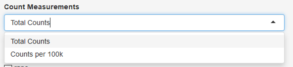
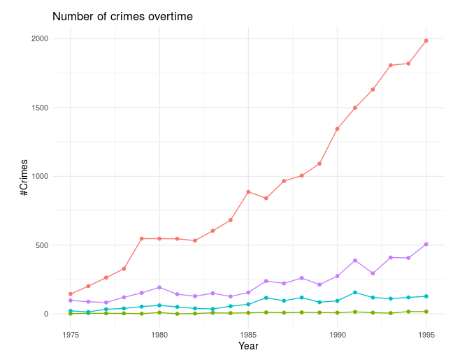
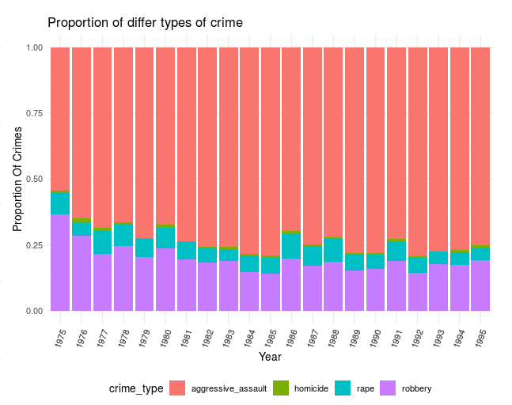

# Milestone 2 - Writeup

Access : The app can be assessed from the following link.
[Crime Buster App](https://birinder1469.shinyapps.io/Crime_Fighters/)

## Rationale

The Crime Buster App is a classic tool for anyone who wants insights into regional crime situations in the United States of America. Potential users may include citizens concerned with the safety of their local area or someone moving to a new location. This app is also potentially useful for sheriffs planning the deployment of their police force by providing visual depictions of past crime data.

The Crime Buster App is designed to allow users to focus on specific results. Thus many selection and filter features are implemented in this app, such as selecting a specific region from the dataset, type of count metric, and crime types. Besides the number of incidents in total and per 100,000 residents user can also extract the proportion of the occurrence of crime types per total crimes in the area. This additional information can shed light for
users to infer what kind of crimes had been more prominent in their jurisdiction of interest. Additionally, a summarization table is implemented to show numeric results that may be useful for users looking for quantitative analysis.   

## Description of the App and Dataset:

The Crime Buster App creates simple and intuitive time series visualization from data complied under the Marshall project from the FBI's Uniform Crime Reporting (UCR) Program. This dataset includes data of the most serious crime incidents (namely robbery, rape, assault and homicides) from 30 police jurisdictions over a 40-years timespan (1975 to 2014) .

The data under consideration have the following features :

| Features   | Description   |
|---|---|
|`State`   | Name of state in the US  |
|`Department`   |  Police jurisdiction  |
| `year`  |  Year of consideration |
| `violent_crime` , `violent_per_100k`  | Total violent crimes and crimes per 100k residents  |
| `homs`,`homs_per_100k`  | Total homicides and homicides per 100k residents |
| `rape`, `rape_per_100k`  | Total rape crimes and rape crimes per 100k residents   |
|  `rob`,`rob_per_100k` |  Total robberies and robberies per 100k residents  |
|`assault`,`agg_ass_per_100k`| Total assaults and assaults per 100k residents  |

The current version of Crime Buster App can showcase data from six major states: Arizona, California, Colorado Florida, New York and Texas. Information about the four major crime incidents: Robbery, Assault, Rape and Homicide, in total and per 100,000 residents of have been can be seen on the app.

## Tasks

These were the tasks at hand for Milestone 2

- Wrangle data
    - Remove empty entries
    - Scale data where only several months out of the entire year had recorded data
- Create plots
    - Timeline plot of crimes
    - Proportion plot of crimes
- Create summary table
    - Calculate net and annual changes of crime incidents
- Implement interactive use of Shiny
- Deploy Shiny App prototype on shiny.io

## Data Extraction :

R Studio was used for data wrangling and any further modification in the app shall be done through the `EDA.R` and `app.R` scripts. Departments were combined state-wise for six major States. There were missing entries in the data, but the missing data would not cause any hindrance in the usage of the app. Some departments did not have data recorded from all 12-months in particular years. In such instances, departments with data recorded for more than 9 months was scaled to 12 months, others were dropped to `NA` as it was determined that the data was not representative of the entire year.

## Usage of the app :

The app is highly user friendly and easy to use.   The Interface looks like the image below and it contains following features:

1. Year Slider (Slider)
2. State Selector (Drop Down)
3. Department Selector (Drop Down)
4. Count Measurement choice (Drop Down)
5. Crime Type Selector (Check Box)

### Selection Options

##### 1. Year Slider

The Year Slider can be used to choose any range from 1975 to 2014 by sliding the knobs. Results will be displayed only for the chosen year range.

##### 2. State Selector

The State Selector can be used to choose the state for which we want to see the crime data. Users can chose out of the six states shown below. Note that this app cannot show data from all department within the selected state, subsequent selection of department is needed (see below).

##### 3. Department Selector

Users can chose out of 30 departments/jurisdictions and see the crime data for specific department within that state. The options for this selection will change according to the state selected above.

##### 4. Count Measurement choice

User can choose to see the data for either total number of crimes in the area or crimes per 100,000 residents of the area.

##### 5. Crime Type choice

User can select the crimes of interest out of the four crime types available. Selection of multiple crime types is allowed.

### Display Panel

There are two outputs figures that would display data interactively according to user selections

##### Time Trend Plot

The first plot shows the time trend data for the selected state, department and the year of interest. Different crimes are shown through different colorations as defined by the legend.

##### Proportion Plot

Users also get access to the bar charts showing the proportion of different crimes out of total crime incidents in that jurisdiction.
This plots shows that there had been few incidents of homicides out of the total crime reported but much more assaults and robberies in this area. Police can take necessary steps accordingly.

##### Summarization Table

If the users are interested to see exact numbers, the summarization table shows  the calculated net changes (in counts and percentages) of incidents in the specific jurisdiction for the specified time interval, and the average annual change in that interval.

## Vision and Next Steps

So far the app has the functionalities proposed earlier. In the future, the development of the Crime Buster app is to be able to include more states and jurisdictions in the selection. A feature that might be useful to implement is the 'hover' feature that allows users to see the data represented at each point on the plots. Additionally, a toggle can be implemented to collapse the selection panel and allow users to maximize their screen space to explore data in the plots.

We hope that the app will be helpful to the police and citizens in getting information about the crime situations around them.
