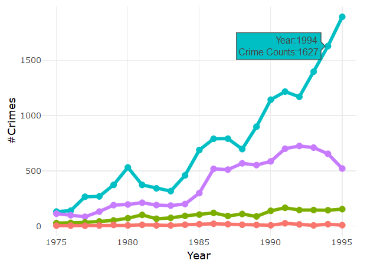
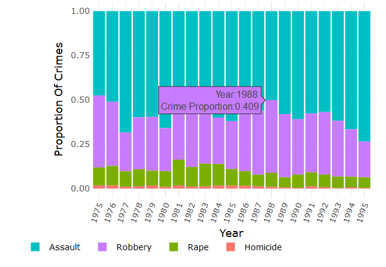

**The Last Improvement**

At present stage, we were quite happy with the current deployed app,  but as it was rightly said "if you have a curious mind there is always more". We wanted to explore how to enhance user's interest and attention towards the app. As Cydney discussed during lectures, the user would be more interested in using the app if he/she felt connected to the task accomplished by the app.
Earlier we had a generic tagline which we changed to be more user-centric by stating a question toward the user.    
**Has your locality been safe in the past?  Check it out yourself.**  
This tagline was intended to capture user's interest, especially if they were moving to a new region. The app made it easier to explore the safety and crime situation which played a large aspect in any moving decisions.

Another useful feature was suggested by our peers during the feedback session. Which was the ability to show specific numbers on the plots as users hover over specific data points. These included the number of crime incidents and the proportion of a crime type in the year and area selected. The implementation of this feature was our prime focus in this milestone, because we felt that this feature would greatly enhance the functionality of our app. At the completion of this milestone, we could proudly say that we were successful in this endeavor.

We had many challenges while implementing the hover feature because we had originally coded all the plots using the ``ggplot2`` package. In the process, we explored a couple of different packages with little success. However, after a valuable suggestion from Vincenzo we wrapped both plots using ``plotly``. In the beginning, we struggled with ``plotly`` syntax and customization, but was successful in the end with how we envisioned our app to function. The following showed how the hover feature looked like :

|    
Hover over Line plot 
         | 
Hover over Bar plot
 |
|-------------------------:|:-------------------------|
|  |  |

Although `plotly` served the hover function beyond our expectation, there was a downfall to the use of `plotly`. When all four types of crime were selected, the `plotly` legend was truncated and failed to show all four labels. This seemed to be an ongoing bug in the `plotly` package that had not yet been resolved ([`plotly github issue`](https://github.com/ropensci/plotly/issues/848)). If given more time, we would explore further into troubleshooting this problem. We decided to keep `plotly` wrapper as we felt that this function is very valuable to users as it increase the transparency of data behind the plots and the summary table. We felt that the legend was an acceptable compromisation at this stage as it was still intuitive to users which color represent which crime type by the use of elimination. This was undesirable in terms of readability, however, in this compromise we chose data transparency.

If we had more time and the flexibility to work from scratch we would implement the USA map in the app as well. We wished to have a interactive mao that showed the grand scheme of crime situation in the entire country. Additionally, we envisioned that there would be a function where hovering above each region would display the data about the crime situation, which would also interact with the time and proportion plots.
